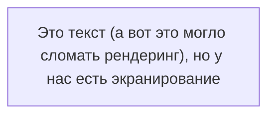
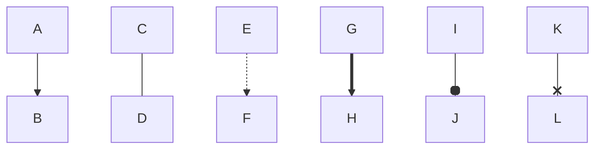
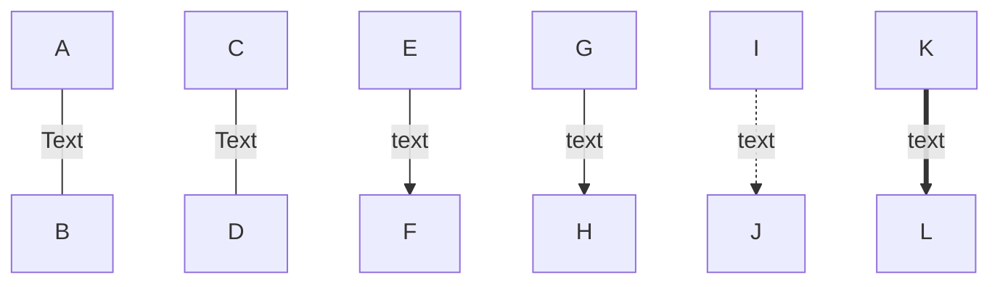
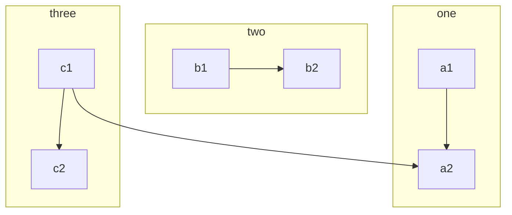
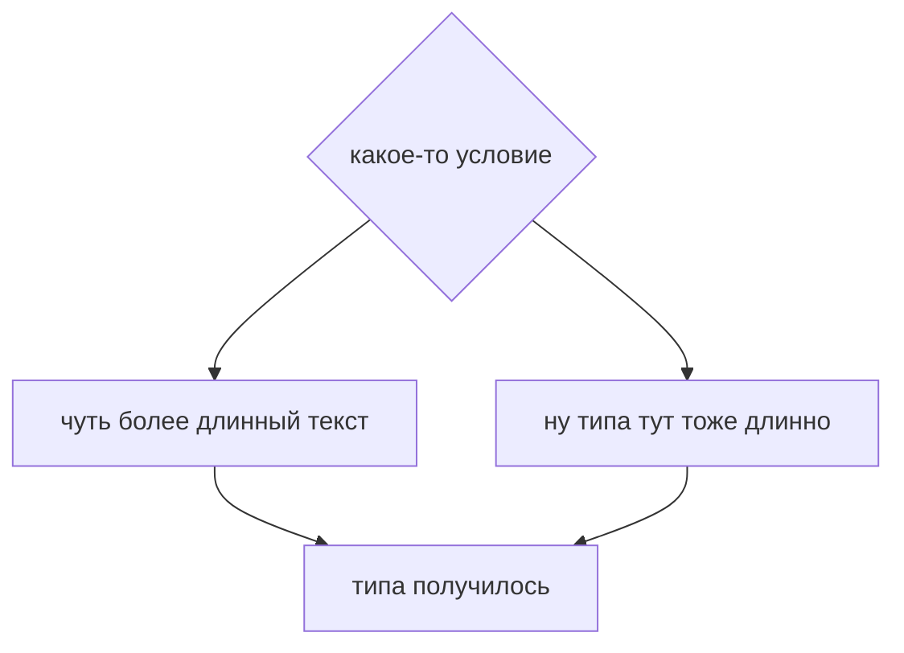

 # mermaid  
 ## Формы:
  
 ```mermaid
flowchart TB
  node1[Форма 1]  
  node2(Форма 2)
  node3([Форма 3])
  node4[[Форма 4]]
  node5[(Форма 5)]
  node6((Форма 6))
  node7>Форма 7]
  node8{Форма 8}
  node9{{Форма 9}}
  node10[/Форма 10/]
  node11[\Форма 11\]
  node12[/Форма 12\]
  node13[\Форма 13/]
```
## Размещение текста:  


## Узлы:  


## Текст на стрелочке:  


## Под блок-схемы

## test  

