 # mermaid  
 ## Формы:
  
 ```mermaid
flowchart TB
  node1[Форма 1]  
  node2(Форма 2)
  node3([Форма 3])
  node4[[Форма 4]]
  node5[(Форма 5)]
  node6((Форма 6))
  node7>Форма 7]
  node8{Форма 8}
  node9{{Форма 9}}
  node10[/Форма 10/]
  node11[\Форма 11\]
  node12[/Форма 12\]
  node13[\Форма 13/]
```
## Размещение текста:  

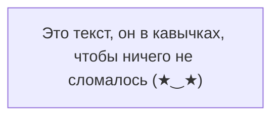
## Ориентация:  
```    
    TB - top to bottom
    TD - top-down/ same as top to bottom
    BT - bottom to top
    RL - right to left
    LR - left to right
```

## Узлы:  

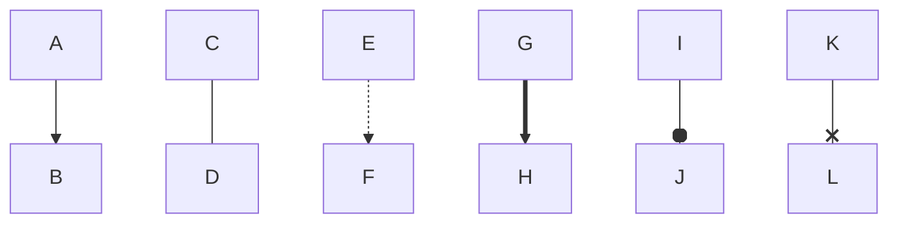
## Текст на стрелочке:  

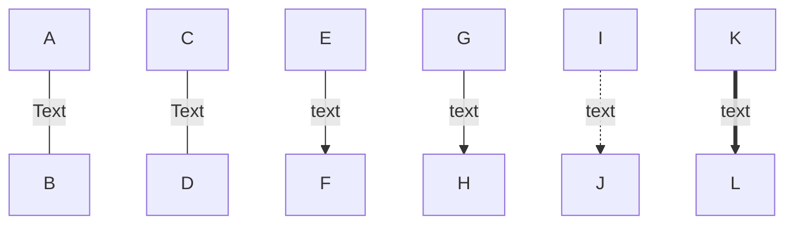
## Cоединения:  
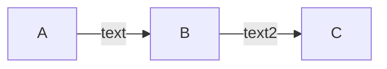
## Cоединения 2:  
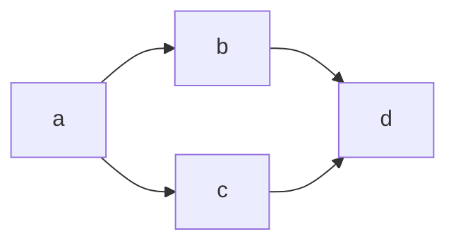
## Cоединения 3:  
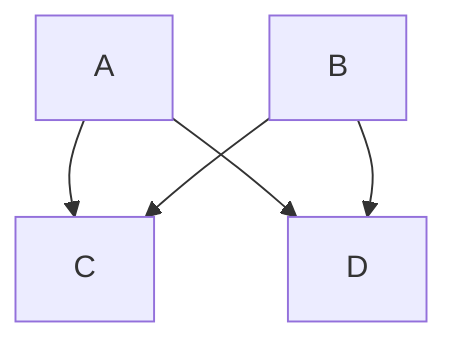
## Cоединения 3(альтернативная запись):  

## Подблок-схемы:
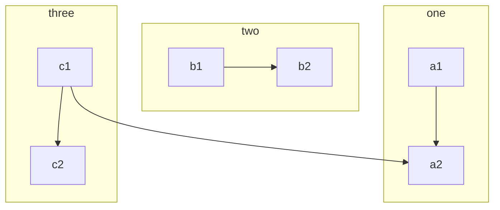
## Подблок-схемы 2:  
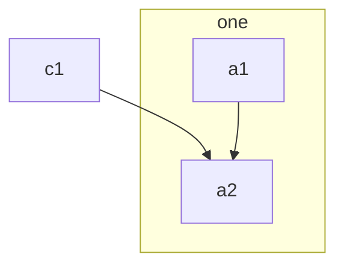
## Подблок-схемы 3:  
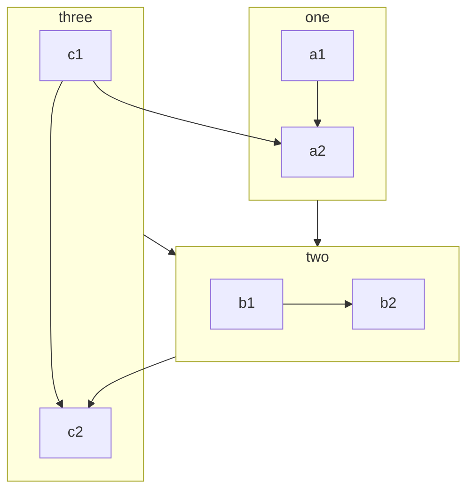
## Условие  
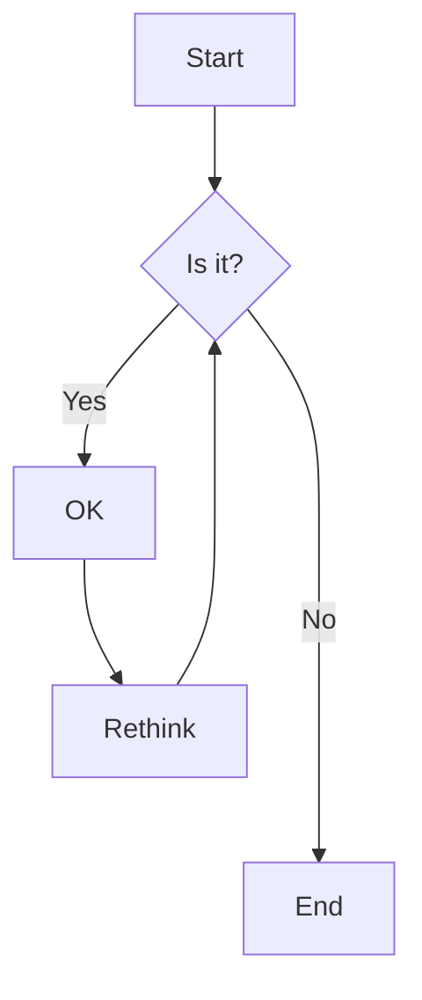
## Условие + цвета   
Используем цвета HTML  
P.S. подходит как имя цвета так и шестнадцатеричное представление цвета в RGB
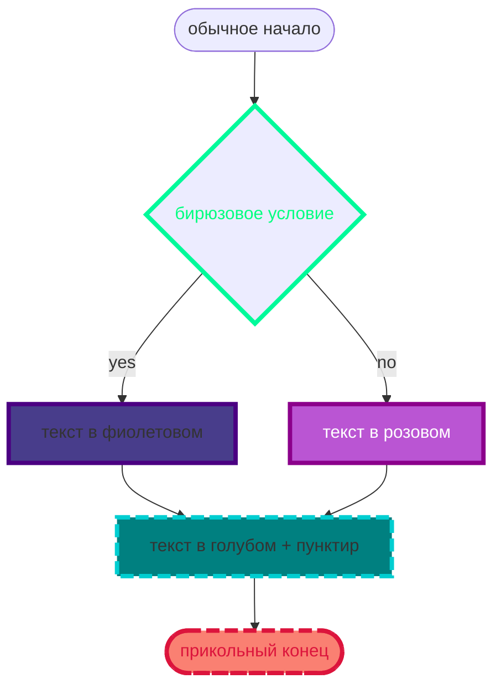
    fill — заливка;

    stroke — цвет границы;

    stroke-width — толщина границы;

    color — цвет текста;

    stroke-dasharray — пунктирная граница.

